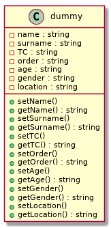
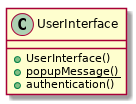
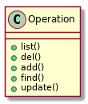
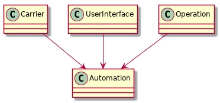

# Table of Contents

1.  [Giriş](#orga1446fd)
2.  [Kullanım](#org7420188)
3.  [Programın iç yapısı](#orgece1258)
    1.  [database.txt](#org411b486)
    2.  [main.cpp](#orgd87b0df)
        1.  [Classlar ve Açıklamaları](#orgf8033a2)

# Giriş

-   Bu projede, "Kalas Kargo" adlı bir kargo şirketinin, Kuryelerin şahsi
    bilgileri ve teslimatını yapacakları ürünlerin bilgileri kayıt edilir.

-   Kayıt edilen bilgiler sırasıyla;
    1.  TC kimlik numarası
    2.  İsim
    3.  Soy İsim
    4.  Yaş
    5.  Kuryenin taşıdığı ürün (Sipariş)
    6.  Cinsiyet
    7.  Tesliman noktası

# Kullanım

-   Kullanıcı Programı açtığında, karşısına şirketin adı ve altında sıralanmış
    işlem seçenekleri sunulur
-   Bu seçenekleri seçmek için, başında bulunan numaraların yazılıp `Enter` tuşuna
    basılması gerekir
-   Seçenekler kullanıcıyı adım adım yönlendirme özelliğine sahiptir.

# Programın iç yapısı

-   Proje içinde 2 temel dosya bulunur;
    -   main.cpp
    -   database.txt

## database.txt

-   Kalas Kargo'nun Kurye bilgilerinin kayıt edildiği dosya
-   Program her işlemde bu dosyayı modifiye eder

## main.cpp

-   Program temelde 4 class'dan oluşur
    1.  Carrier *(kurye)*
    2.  UserInterface *(Kullanıcı arayüzü)*
    3.  Operation *(işlem)*
    4.  Automation *(otomasyon)*

### Classlar ve Açıklamaları

1.  Carrier

    -   Kuryenin bütün bilgilerinin ve metodlarının bulunduğu klastır
    -   Yapısı:
        
        

2.  UserInterface

    -   Kullanıcının programla olan etkileşimini sağlayan klastır
    -   Yapısı:
        
        

3.  Operation

    -   **database.txt** dosyasında değişiklik yapan klastır
    -   Yapısı:
        
        

4.  Automation

    -   **Carrier**, **UserInterface**, **Operation** klaslarının tek çatı altında birleştiği
        klastır
    -   Yapısı
        
        

